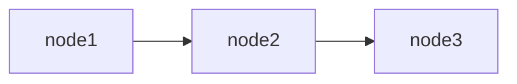
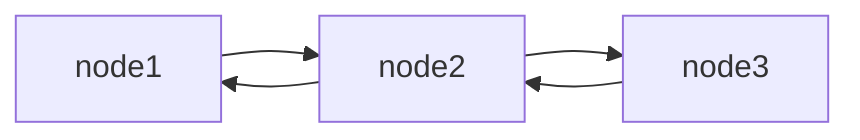

# 链表
链表和[[algorithm/数据结构/数组|数组]]一样可以存储一系列数据，数组是在内存中分配了“一整块”区域来存储，而链表中的元素在内存中是独立的（即存储位置不一定连续）。
## 节点
链表的元素称为节点，每个节点除了存储元素数据之外，外存储着指针，指针指向其他链表的地址。
处于链表最开始位置的节点称为**头节点**（Head）。
## 单链表

```java
class Node<T> {
	T value;
	Node next;
	public Node(T value) {
		this.value = value;
	}
}
```

## 双链表

```java
class Node<T> {
	T value;
	Node next;
	Node prev;
	public Node(T value) {
		this.value = value;
	}
}
```
## 为什么使用链表？
链表乍看是一种很麻烦的数据结构，没有数组来的直观简单，而且链表的索引时间复杂度是$O(N)$的，而数组的索引时间复杂度是$O(1)$的。
那么为什么还需要用链表呢？
由于链表中的元素在内存中是独立存在的，在**删除**和**插入**操作上链表相比于数组更灵活。
如果在数组上删除一个元素，其后边所有元素都需要向前挪一个位置。同样的，如果在数组中插入一个元素，其后边的所有元素都要往后挪一个位置。
而在链表上删除一个元素时，只需要将删除节点的前后两个节点重新连接就好。如果是插入元素，则把插入位置的链接断开，指向新节点，新节点再只想`next`节点就好。

| 数据结构 | 查     | 改     | 增     | 删     |
| -------- | ------ | ------ | ------ | ------ |
| 数组     | $O(1)$ | $O(1)$ | $O(N)$ | $O(N)$ |
| 链表     | $O(N)$ | $O(N)$ | $O(1)$ | $O(1)$ |

