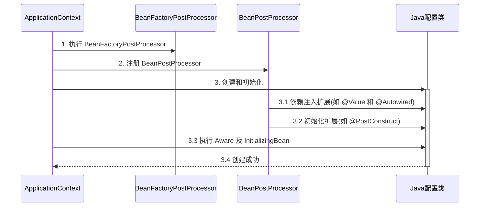

# Aware接口

```mermaid
sequenceDiagram 
participant ac as ApplicationContext
participant bfpp as BeanFactoryPostProcessor
participant bpp as BeanPostProcessor
participant config as Java配置类
ac ->> bfpp : 1. 执行 BeanFactoryPostProcessor
ac ->> bpp : 2. 注册 BeanPostProcessor
ac ->> +config : 3. 创建和初始化
bpp ->> config : 3.1 依赖注入扩展(如 @Value 和 @Autowired)
bpp ->> config : 3.2 初始化扩展(如 @PostConstruct)
ac ->> config : 3.3 执行 Aware 及 InitializingBean
config -->> -ac : 3.4 创建成功
```
dd