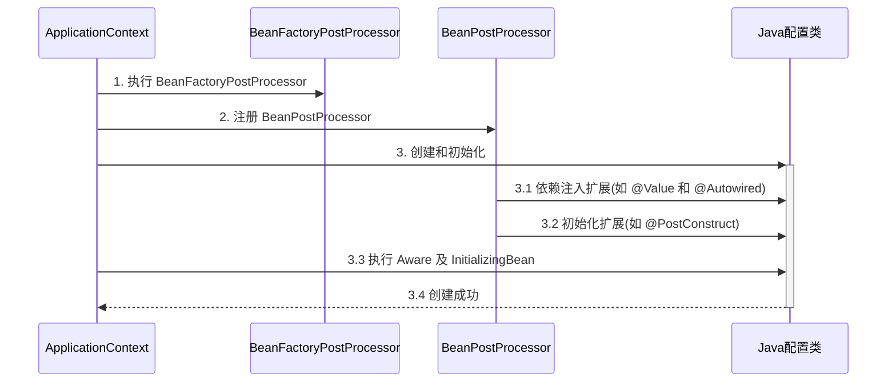
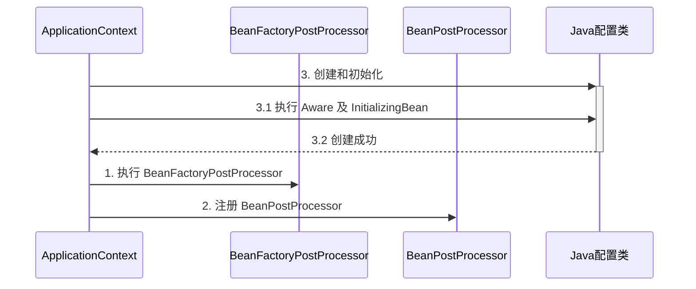

# Aware接口
#spring
## Aware接口的用途
介绍四种Aware接口:
- BeanNameAware 注入 bean 的名字
- BeanFactoryAware 注入 BeanFactory 的名字
- ApplicatioContextAware 注入 ApplicationContext 容器
- EmbeddedValueResolverAware 注入 ${} 解析器
这些 Aware 提供了一些方法, 在这些方法里可以拿到对应的信息:
```java
@Component  
public class Bean1 implements BeanNameAware, BeanFactoryAware, ApplicationContextAware {  
   @Override  
 public void setBeanFactory(BeanFactory beanFactory) throws BeansException {  
      System.out.println("beanFactory = " + beanFactory);  
 }  
  
   @Override  
 public void setBeanName(String name) {  
      System.out.println("name = " + name);  
 }  
  
   @Override  
 public void setApplicationContext(ApplicationContext applicationContext) throws BeansException {  
      System.out.println("applicationContext = " + applicationContext);  
 }  
}
```

## Aware接口的特点

Aware接口可以看作是 Spring ==内部==使用的注入方式.
而通过@Autowired @Value 这样的方式进行注入的属于==扩展功能==.

Aware v.s. 扩展功能
- Aware更安全, 任何情况下都能注入(相对应的, @Autowired的方式在某些情况下会失效)
- 扩展功能在某些情况下会失效
- Aware使用起来比较麻烦, 而扩展功能使用起来方便

## Bean的依赖注入流程
1. 创建applicationContext, 并进行注册(context.registerBean)
2. 执行context.refresh进行注入操作
3. 注入BeanFactory的后处理器
4. 注入Bean的后处理器
5. Bean的创建和初始化(其中包含了扩展功能)
6. 对Bean执行Aware接口对应的方法
7. 创建成功

如下图所示

值得注意的是, Aware 接口是一定被执行的.

## 扩展功能失效的情况
在某些特殊情况下, 比如 BeanFactory 的后处理器在Java配置类中注入, 在这种情况下, 如果要执行 BeanFactoryPostProcessor 就必须先注入 Java 配置类. 所以==对Bean的创建和初始化步骤被提前了==,  由于Java配置类的创建提前了, 此时还没有各种后处理器, 所以自然处理不了@Value或@Autowired等注解了.

上述过程如下图所示

对应的测试代码如下:
```java
@Configuration
public class MyConfig1 {

    private static final Logger log = LoggerFactory.getLogger(MyConfig1.class);

    @Autowired
    public void setApplicationContext(ApplicationContext applicationContext) {
        log.debug("注入 ApplicationContext");
    }

    @PostConstruct
    public void init() {
        log.debug("初始化");
    }

    @Bean //  ⬅️ 注释或添加 beanFactory 后处理器对应上方两种情况
    public BeanFactoryPostProcessor processor1() {
        return beanFactory -> {
            log.debug("执行 processor1");
        };
    }

}
```

```ad-note
title: 解决方法:
- 用内置依赖注入和初始化(Aware接口)取代扩展功能的注入和初始化
- 用==静态==工厂方法替代实例工厂方法, 避免工厂对象提前被创建
```
