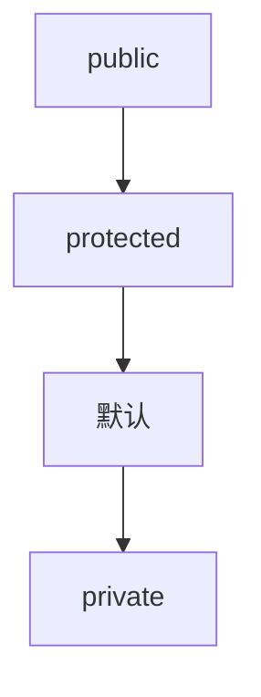

# 可见性
可见性由高到低排列为:

```mermaid
graph TD
	public --> protected --> 默认 --> private
```
- public
	public声明的内容对其他所有类都是可见的
- protected
	protected声明的内容对子类和同一个包内的其他类都是可见的
- 默认
	如果不加修饰关键词，则对同一个包内的其他类都是可见的
- private
	private声明内容只对本类可见，对其他所有类都不可见