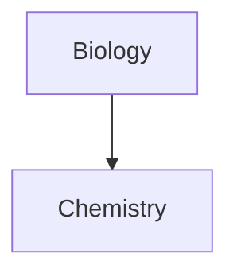

# 序章
首先从一份最简单的 C 语言程序说起：
```c
#include <stdio.h>

int main() {
	printf("hello. world\n");
	return 0;
}
```
### 信息就是位+上下文
上面那一段代码在计算机中是以0和1组成的**位**表示的，8个位被组织成一组，成为**字节**。经过 ASCII 编码，一个字符由一个字节表示，比如字符`#` 由`00010011` 表示。据此我们明白一串代码在计算机看来就是一串由0和1组成的位组成的序列。
但光有**位**还不够，对于下面定义变量`a`的两串代码
```C
int a;
```
和
```c
long a;
```
同样是定义整数变量`a`，第一种方式开辟了4个字节的空间，而第二种方式开辟了8个字节的空间，可以发现对于计算机中储存的同一个字符串`a`，计算机做出了不同的操作，造成这种区别的原因是变量`a`的**上下文**不同，第一段代码是通过`int`关键词定义的，而第二段代码的`a`是通过`long`关键词定义的。
据此我们可以得出，对计算机而言，信息就是**位+上下文**。
### 高级程序的转化
一段高级程序经过以下流程转化成**可执行的二进制程序**的
// 待补充流程图

### 程序的执行过程
在得到可执行的二进制文件后，需要在`shell`中输入以下代码执行
```shell
linux> ./hello
hello, world
```
首先由I/O设备检测到键盘输入，通过 I/O 总线传递给 CPU 处理进而显示到 Shell 上。当检测到回车时，Shell 会搜索当前目录下是否有名为 hello 的文件，如果有便将磁盘上的程序文件复制到内存，一旦复制完毕，处理器便开始执行。
进入执行阶段，CPU 开始处理这个可执行二进制文件。CPU 内有一个大小为一个字（64位机型位8字节，32位机型位4字节）的存储设备（或寄存器），称为**程序寄存器**（PC），这个寄存器指向内存中正在执行的机器语言指令的地址。
从系统通电开始，处理器一直会处理PC指向的指令，然后再更新PC，使其指向下一条指令（不一定是地址上相邻的指令）。
```ad-note
这里的机器语言指令是由**指令集架构**决定的，对于RISC（精简指令集）来说，一条指令可能对应少量**操作**，而对于CISC（复杂指令集），一条指令可能对应多个**操作**。
```
### 操作系统
在`hello`程序的例子中，当 shell 加载和运行 hello 程序时，以及 hello 程序输出结果时，shell 和 hello 程序都没有直接访问硬盘、显示器、磁盘或者内存。取而代之的是，它们依靠**操作系统**提供的服务，操作系统可以看作是程序和硬件之间的一层软件，所有程序对硬件的操作都必须经过操作系统。
操作系统有两个基本功能：
- 防止硬件被失控的程序滥用
- 向应用程序提供**简单**、**一致**的机制来控制复杂、各不相同的低级硬件设备。
#### <span style="color: lightgreen;">进程</span>
#### <span style="color: lightgreen;">线程</span>
#### <span style="color: lightgreen;">虚拟内存</span>
#### <span style="color: lightgreen;">文件</span>
